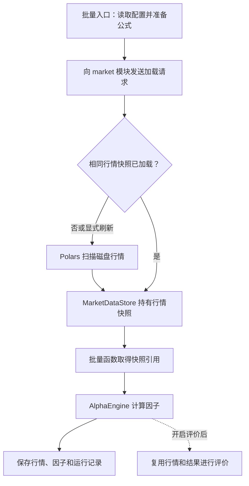

# Alpha 因子研究与行情回放

基于 vn.py 改造的量化研究项目，围绕本地 Parquet 行情、因子表达式计算、因子自动搜索及事件驱动的行情回放展开。

本文记录项目现状和每日更新。设计方案与已实现功能分别标明，更新按日期倒序排列。

## 项目目标

```text
历史行情 → 数据准备与时间切分 → 自动生成表达式
        → 训练集评价与进化 → 验证集筛选 → 固定因子库
                                                ↓
历史行情逐根回放 → 计算已选因子 → FACTOR 事件 → 策略
```

模型训练是后续可选衔接环节。上述整体流程尚未全部实现。

## 当前状态

| 部分 | 状态 |
| --- | --- |
| 本地 Parquet 行情读取 | 已验证沪深 2026 年已有行情，共 8594 个标的、1418741 条日线 |
| 全市场批量因子计算 | 支持 Polars 内部并行及公式分组并发，默认计算 6 个固定公式和 15 个候选 |
| 行情模块与快照复用 | 独立 `market` 模块长期持有行情，支持跨轮次复用、刷新、清空和退出释放 |
| Alpha 公式、表达式树、解析与计算 | 已有代码 |
| 未来收益标签与 Rank IC 评价 | 已接入主入口，调用 Alphalens，输出训练/留出分段报告 |
| 行情事件回放 | 已验证 100 只股票真实行情、批量因子计算和策略模块接收事件 |
| 回放因子与策略配置 | 默认加载 6 个基础因子公式，默认策略未激活 |
| 生成因子转策略 | 因子值已能送达策略接口；候选筛选、交易规则和订单闭环尚未自动接入 |
| 表达式随机迭代 | 主入口生成候选、计算及评价；尚不按评价结果自动筛选或进化 |
| 交叉变异和进化搜索 | 已完成设计，尚未实现 |
| 固定因子库导出与加载 | 已完成设计，尚未实现 |
| 模型训练 | 已有独立流程，尚未与自动搜索和回放完整衔接 |

“已有代码”表示仓库中存在相应实现，不代表已完成本机端到端运行验证。

## 代码与设计入口

| 入口 | 内容 |
| --- | --- |
| [vnpy/main.py](vnpy/main.py) | 统一应用入口，根据配置执行批量计算、导入或回放；直接运行默认进入回放 |
| [examples/full_market_batch.py](examples/full_market_batch.py) | 全市场批量计算入口，可在 IDE 中直接运行 |
| [config/runtime.full_market.json](config/runtime.full_market.json) | 沪深 2026 年全部已有行情、21 个公式、启用批量计算，默认关闭评价 |
| [config/runtime.json](config/runtime.json) | 保留的原始行情回放配置，当前入口不默认加载 |
| [config/runtime.basic_alphas.json](config/runtime.basic_alphas.json) | 当前默认配置：100 股票、6 个基础公式、15 个自动候选及 Alphalens 评价 |
| [vnpy/alpha/alpha.py](vnpy/alpha/alpha.py) | Alpha 名称与公式定义 |
| [vnpy/alpha/engine.py](vnpy/alpha/engine.py) | 统一因子计算引擎 |
| [vnpy/alpha/expression/](vnpy/alpha/expression/) | 表达式树、算子、解析、分析与执行 |
| [vnpy/datafeed/data_market_module.py](vnpy/datafeed/data_market_module.py) | 行情模块注册、加载请求、刷新、清空和注销 |
| [vnpy/datafeed/data_market_store.py](vnpy/datafeed/data_market_store.py) | 持有当前行情快照，为不同计算轮次提供共享数据 |
| [vnpy/datafeed/data_parquet_feed.py](vnpy/datafeed/data_parquet_feed.py) | Parquet 列式读取和逐条回放读取 |
| [vnpy/factor/factor_history_batch.py](vnpy/factor/factor_history_batch.py) | 获取行情快照、批量计算、保存结果及可选评价 |
| [vnpy/factor/factor_realtime_service.py](vnpy/factor/factor_realtime_service.py) | 行情缓存与回放因子计算 |
| [vnpy/quant/workflow.py](vnpy/quant/workflow.py) | 独立模型训练流程 |
| [examples/alpha_formula_pipeline.py](examples/alpha_formula_pipeline.py) | 因子公式示例 |
| [vnpy/alpha/mining/runtime.py](vnpy/alpha/mining/runtime.py) | 主流程生成候选、合并固定公式并传递给因子计算 |
| [vnpy/alpha/modeling/runtime_evaluation.py](vnpy/alpha/modeling/runtime_evaluation.py) | 主流程评价、收益对齐、分段边界和报告保存 |
| [vnpy/strategy/strategy_template.py](vnpy/strategy/strategy_template.py) | `on_factor()` 策略接口及信号、目标仓位输出约定 |
| [vnpy/strategy/strategy_context.py](vnpy/strategy/strategy_context.py) | `StrategySignal` 与 `TargetPosition` 数据结构 |
| [整个项目代码框架](docs/code_framework_design.md) | 目标目录、模块职责、核心对象与接口 |
| [Alpha 自动搜索设计](docs/alpha_mining_design.md) | 搜索空间、进化、数据边界、评价与实施阶段 |

## 运行入口与配置

全市场历史批量计算已提供独立入口：[examples/full_market_batch.py](examples/full_market_batch.py)。直接在 IDE 运行该文件，或在项目目录执行 `python examples/full_market_batch.py`，读取 [config/runtime.full_market.json](config/runtime.full_market.json)。原 `vnpy/main.py` 仍默认使用下面的 100 股票回放配置。

### 全市场批量读取和并行计算

新配置读取本地 `SHSE,SZSE` 两个市场在 2026 年全年范围内已有的全部标的行情，`symbols = null` 表示不按代码筛选；这里的“全市场”指所选市场文件内的所有标的，不自动限定为 A 股普通股票，也不包含未选择的市场。配置范围为 `2026-01-01` 至 `2026-12-31`，实际读取到文件中最新已有日期，不补齐尚未出现的交易日。启动时合并 6 个固定公式与 15 个自动候选，随后一次计算完整区间并保存行情、因子结果和运行记录。

```json
"history_batch": {
  "enabled": true,
  "workers": 1,
  "output_root": "../data/history_batch"
}
```

`ParquetDataFeed.load_frame()` 直接扫描 Parquet，把日期、标的和数据过滤下推到读取阶段，仅加载行情字段，跳过逐条构造 K 线对象。Polars 并行读取文件，统一检查主键并排序后计算全部公式。`workers = 1` 使用合并执行计划与 Polars 内部线程池，并非单线程计算；大于 1 时，额外用线程池并发执行多组公式。每组共享完整行情表，保留跨年滚动历史和同日完整可用截面，不按股票或日期切断公式依赖。增加组数会失去跨组公共表达式复用、增加中间数据内存，不保证更快。

输出写入 `data/history_batch/batch_.../` 的 `market.parquet`、`factors.parquet` 和 `manifest.json`。每次运行使用独立目录；记录输入配置、实际日期、标的数、公式、读取/计算/总耗时和运行状态。输出路径相对配置文件定位，不依赖 IDE 工作目录。新配置默认关闭因子评价；开启 `factor_evaluation.enabled` 后，评价直接复用本次行情与因子结果。`history_batch` 与 `parquet_import` 不可同时启用。

当前实现需要所选区间的行情、因子输出与计算中间结果能放进内存；不会自动读取起始日期之前的预热行情，窗口不足处保留空值。停牌或缺失行情不填充，横截面按该日经过过滤后实际存在的标的计算。

### 行情模块与数据流

行情表由全局 `main.module_engine` 注册的独立 `market` 模块长期持有：`ModuleEngine → market ModuleContext → MarketDataStore → MarketSnapshot.frame`。模块实现见 [data_market_module.py](vnpy/datafeed/data_market_module.py)，快照管理见 [data_market_store.py](vnpy/datafeed/data_market_store.py)。批量函数通过 `MARKET_LOAD_REQUEST` 请求行情，读盘发生在 `Module-market` 线程；因子引擎使用模块提供的快照进行计算。



加载请求在模块队列中处理；请求方等待加载或复用完成，再把 `snapshot.frame` 作为参数传入 `AlphaEngine.calculate_parallel()`。一次加载请求对应整段行情，随后在内存中计算；目前没有读取与因子计算重叠执行的流水线。批量分支到保存或评价结束，策略事件回放使用下文的独立入口。

同一应用内多次调用 `run_from_config()`，相同行情范围和过滤条件复用当前快照；更换公式或并发参数不会重新读盘。模块只持有一份当前快照，切换数据范围时成功加载后整体替换；失败会保留旧快照并将异常返回请求方。外部读取获得共享底层列缓冲区的 DataFrame clone，避免调用方原地改列影响模块数据，已取得的旧快照在刷新后仍可用于完成当前计算。

**快照不是一条 K 线，而是一次加载得到的整张行情表。**一条日 K 线对应表中的一行，例如 `600000.SHSE` 在 `2026-03-30` 的开高低收、成交量等。假设加载了 100 只股票各 60 个交易日，快照就包含约 6000 行。下面只列出其中两行的收盘价作为示意：

| 快照 | 日期 | 股票 | 收盘价 |
| --- | --- | --- | ---: |
| 旧版 A | 2026-03-30 | 600000.SHSE | 10.10 |
| 旧版 A | 2026-03-31 | 600000.SHSE | 10.20 |
| 新版 B | 2026-03-30 | 600000.SHSE | 10.10 |
| 新版 B | 2026-03-31 | 600000.SHSE | 10.25 |

任务甲先拿到 A，之后磁盘数据更新并刷新为 B：甲仍用 A 的 `10.20` 算完，新开始的任务乙用 B 的 `10.25`。刷新读盘期间，新任务仍可取得 A；B 加载成功后才替换模块当前持有的版本。旧任务未结束时，A 和 B 可能同时占内存。快照只在内存中保留这一版行情的引用，不等于另存一份磁盘备份。

下面的片段用于同一应用运行期间，`config` 为已解析的运行配置，`alpha_engine` 为已经创建的因子引擎：

```python
from vnpy.main import module_engine
from vnpy.datafeed.data_market_module import (
    get_market_store, load_market_snapshot, clear_market_data, print_market_table,
)

# 已运行过一轮后，其他模块可直接取得仍驻留内存的行情。
snapshot = get_market_store(module_engine).snapshot()
factors = alpha_engine.calculate_parallel(snapshot.frame)

# 磁盘文件更新后显式刷新；相同配置默认不会自动重读磁盘。
load_market_snapshot(module_engine, config.parquet, reload=True)
# 调试：将刷新后的整张表逐行写入 data/market_table.tsv。
rows = print_market_table(module_engine, output_path="data/market_table.tsv")
print(f"已输出 {rows} 行")
# 需要释放行情而保留模块时显式清空。
clear_market_data(module_engine)
```

调试时可调用 `print_market_table(module_engine)`，逐行打印当前快照的全部行情；传入 `output_path` 可将全部行列写入制表符分隔文件，路径相对当前工作目录解析。此接口只读取已加载的快照，返回打印的行数，不会将 Polars 的表格显示截断当作完整结果。

每轮批量函数返回后保留行情；`main()` 应用退出时通过 `unregister_market_module()` 排空请求、清空行情并注销模块。进程重启后重新加载。运行记录增加快照 ID、是否复用及原始加载耗时；`read_seconds` 现在包含请求等待时间，命中缓存时不代表发生了读盘。多轮计算仍各自保存因子和行情文件。

`datafeed` 的实现文件统一使用 `data_` 前缀，目录职责如下：

```text
vnpy/datafeed/
├── __init__.py             包入口及公开类型导出
├── data_model.py           行情对象和数据来源定义
├── data_parquet_feed.py    Parquet 行情读取
├── data_daily_store.py     按日持久化行情
├── data_bar_cache.py       回放所需的历史 K 线窗口
├── data_market_store.py    应用内持有的完整行情快照
└── data_market_module.py   行情模块及生命周期管理
```

### 全市场验证结果

2026-09-29 本机已验证的实际日期为 `2026-01-05` 至 `2026-09-15`，共 8594 个标的、171 个交易日、1418741 条行情、21 个因子。连续两轮计算仅在 `Module-market` 线程读取源数据一次，两轮快照 ID 和因子结果一致，且与模块化之前的结果一致。

| 项目 | 本机测量结果 |
| --- | --- |
| 首轮获取行情，含请求和加载校验 | 0.517 秒 |
| 第二轮获取已缓存行情 | 0.001 秒 |
| 第一轮 / 第二轮因子计算 | 1.292 / 1.263 秒 |
| 行情表 / 21 因子结果表估算内存 | 约 91 / 255 MiB |

表内存不包含排序、计算中间结果及其他进程开销；当前没有内存限额或自动分区淘汰机制。耗时来自本机单次连续两轮验证，可能受操作系统缓存影响，不含进程启动，不代表其他机器或数据规模。验证记录保存在本机 `data/validation/market_module.json`，该目录不纳入版本控制。

### 100 标的行情回放

当前默认加载 `config/runtime.basic_alphas.json`，使用 `mode = "parquet"`，并设置 `parquet_import.enabled = false`，因此进入行情回放分支。

启动前根据本机情况检查行情目录、实际可用日期和股票范围。依赖准备好后，使用项目 `.venv` 解释器，在 IDE 中直接运行 `vnpy/main.py`，无需命令行参数。

当前已配置 6 个基础因子，并启用 `expression_iteration`，启动时生成 3 批、每批 5 个候选。两类公式自动合并后进入现有因子计算及策略事件链；默认策略未激活。真实行情读取、因子计算和策略模块接收事件已验证；策略信号及下单成交尚未验证。若使用横截面公式，现有回放还要求显式股票池及同一时点行情对齐。

## 基础因子验证配置

直接运行 `vnpy/main.py`，自动加载 [config/runtime.basic_alphas.json](config/runtime.basic_alphas.json)，执行表达式生成、合并及行情计算。把该配置的 `expression_iteration.enabled` 设为 `false` 可只验证下面 6 个固定公式。默认路径在 `vnpy/config/runtime_config.py` 的 `DEFAULT_RUNTIME_CONFIG` 中设置，按源码位置定位，不依赖 IDE 的工作目录。

默认配置读取 100 只沪市股票在 2026 年第一季度的日线，沿用本地行情目录。股票名单按代码排序，从该区间有完整 56 条记录的 `SHSE.600` 股票中选取前 100 只，仅用于运行验证。`parquet.batch_size = 100` 控制同一时刻每批最多计算的股票数；不足一批和日期切换时也会处理。缺少年度文件时直接报错。基础公式如下：

| 名称 | 公式 | 含义 |
| --- | --- | --- |
| `return_1` | `close / Ref(close, 1) - 1` | 相邻两根 K 线的收盘收益率 |
| `momentum_5` | `close / Ref(close, 5) - 1` | 5 根 K 线间的收盘收益率 |
| `ma_bias_5` | `close / Mean(close, 5) - 1` | 收盘价相对 5 根 K 线均价的偏离 |
| `volatility_5` | `Std(close / Ref(close, 1) - 1, 5)` | 最近 5 个单期收益率的总体标准差，未年化 |
| `volume_ratio_5` | `volume / Mean(volume, 5)` | 当前成交量与最近 5 根 K 线平均成交量的比值 |
| `amplitude_1` | `(high - low) / Ref(close, 1)` | 当根高低价差与上一根收盘价的比值 |

滚动均值包含当前 K 线，窗口按各股票的 K 线数量计数。整组固定公式至少需要 6 根 K 线，回放服务会先等待历史窗口满足再输出结果。公式均不需要横截面对齐。默认策略未激活；日志定期汇总处理进度，结束时报告行情数、样本数、耗时和队列峰值，不逐条打印。启用评价时，回放结束后另外保存完整研究因子表和评价报告。

因子模块中的行情缓存只保留公式最大回看窗口；策略样本缓存独立设置，默认每只股票 1000 条。多个新式公式编译成统一执行计划，相同窗口子表达式复用，按依赖顺序执行，减少逐因子 `collect` 和 `join`；兼容式公式仍走原有计算接口。计算使用 Polars 内部线程池。

## 因子公式如何计算

固定公式在配置文件顶层的 `alphas` 中定义；启用 `expression_iteration` 时，启动阶段还会自动生成候选并合并。两者统一经过表达式解析、编译和计算。例如固定公式：

```json
"alphas": [
  {"name": "momentum_5", "formula": "close / Ref(close, 5) - 1"}
]
```

以上是配置片段，放在完整 JSON 对象中，与 `mode`、`parquet` 同级。数据与公式通过下面的流程结合：

```text
JSON 配置 → Alpha 对象 → 表达式树 → Polars 编译结果
                                            ↓
历史 K 线 → 行情表（datetime、vt_symbol、close 等）→ 执行 → 因子值
```

`ExpressionParser` 使用 `ast.parse()` 读取公式语法，再转换成项目自己的节点；解析过程不会执行公式中的 Python 代码。上面的公式对应：

```text
sub（减法）
├── div（除法）
│   ├── close（字段）
│   └── ts_delay（Ref 的内部名称）
│       ├── close（字段）
│       └── 5（窗口参数）
└── 1（常数）
```

`ExpressionAnalyzer` 推导依赖字段、最少历史长度和横截面要求；`PolarsCompiler` 将字段映射为行情表的列，将算子转换成 Polars 运算。`PolarsExecutor` 在行情表上执行这些运算。

以 `momentum_5` 为例，核心运算相当于以下代码。输入须先按股票和时间排序，实际编译器会将窗口运算拆成中间计算步骤：

```python
previous_close = pl.col("close").shift(5).over("vt_symbol")
factor = pl.col("close") / previous_close - 1
```

`over("vt_symbol")` 保证每只股票使用自己的历史数据。当前收盘价为 15、5 根 K 线前为 10 时，当前因子值为 `15 / 10 - 1 = 0.5`。表达式树决定运算结构，行情提供具体数值；回放中复用编译结果，无需每根 K 线重新解析公式。

### 窗口与输出频率

5 根 K 线是回看跨度，历史足够后每根新 K 线都能产生一个新值：

| 计算时点 | `momentum_5` 的计算 |
| --- | --- |
| 第 6 根 | 第 6 根收盘价 / 第 1 根收盘价 − 1 |
| 第 7 根 | 第 7 根收盘价 / 第 2 根收盘价 − 1 |
| 第 8 根 | 第 8 根收盘价 / 第 3 根收盘价 − 1 |

对 100 根有效日线，该公式通常有 95 个有效值；零分母、缺失数据等会影响有效数量。当前 6 个固定公式作为必需项等待历史窗口满足，再按股票、日期输出 `AlphaSample`，其中 `features` 保存因子名称到因子值的映射。自动生成候选作为可选项，各自预热完成且数值有效时才附加到 `features`，其空值或除零不会阻断固定公式输出。

### 公式与结果存在哪里

| 位置 | 内容 |
| --- | --- |
| `config.raw["alphas"]` | JSON 中的原始因子名称和公式 |
| `AlphaEngine.definitions` | 解析后的因子定义，包括名称、规范化表达式和历史窗口 |
| `AlphaEngine._compiled` | 以因子名称为键的 Polars 编译结果 |
| `RealtimeAlphaService.latest_samples` | 最近一次计算产生的样本 |
| `RealtimeAlphaService.sample_cache` | 按股票缓存的历史样本 |

这些运行时对象保存在内存中。开启 `factor_evaluation` 后，评价流程还会保存独立的完整研究因子表。主入口会创建引擎提前校验公式；回放服务会根据原始配置再创建计算引擎，因此启动时存在两次解析编译，后续可优化为复用。

## 多股票 K 线的回放链路

```text
main() → load_runtime_config() → run_from_config()
    ↓
run_parquet_replay()：启动 factor 和 strategy 模块
    ↓
ParquetDataFeed.iter_history()：读取、筛选并按时间输出 K 线
    ↓
按同一时间点分批 → factor 队列中的 BAR 事件（bars）
    ↓
RealtimeFactorModule.handle()
    ↓
RealtimeAlphaService.on_bars()
    ├── 更新 BarCache，检查历史窗口
    ├── AlphaEngine.from_bars()：整理行情表
    ├── calculate_latest() → 合并后的 Polars 执行计划
    └── 提取当前时点 AlphaSample，写入样本缓存
    ↓
RealtimeFactorModule._publish_sample()
    ↓
strategy 队列中的 FACTOR 事件
    ↓
StrategyEngineModule.handle() → StrategyEngine.on_event() → on_factor()
```

两个模块通过各自的队列和线程处理事件。每批投递后，回放入口等待因子及策略队列处理完成，再发送下一批，保持时间顺序并限制积压；工作线程异常会传回调用者。每个 FACTOR 事件只携带对应股票的样本和因子结果，避免不同股票的值混入策略。单根行情的 `post_bar()` 和 `on_bar()` 接口仍可使用。

当前已验证到策略引擎接收因子事件。具体策略只有启用且订阅匹配时才会执行 `strategy.on_factor()`；默认策略未启用，主入口也未注册交易和订单模块，因此尚未形成信号、下单、成交的完整闭环。

## 第一阶段：表达式随机迭代

直接在 IDE 中运行现有 [vnpy/main.py](vnpy/main.py)，无需额外入口或命令行参数。配置统一放在当前加载的 `config/runtime.basic_alphas.json`，顶层 `expression_iteration` 控制生成过程：

```json
"expression_iteration": {
  "enabled": true,
  "seed": 42,
  "batches": 3,
  "batch_size": 5,
  "max_attempts_per_batch": 500,
  "output_root": "../data/alpha_mining",
  "search_space": {
    "fields": ["open", "high", "low", "close", "volume"],
    "operators": ["add", "sub", "mul", "div", "Ref", "Delta", "Mean", "Std"],
    "windows": [1, 3, 5],
    "max_depth": 4,
    "max_nodes": 20,
    "max_lookback": 20
  }
}
```

上面是运行配置中的片段，不是完整配置文件。默认连续生成 3 批、每批 5 个新候选，总计 15 个，与原有 6 个固定公式合并后直接传给因子模块。候选与固定公式结构相同时保留固定公式名称。批次共享随机数状态和结构哈希集合；同代码、环境、配置和种子下，候选顺序与批次统计可复现。

```text
main → load_runtime_config → prepare_runtime_alphas
     → 分批生成表达式 → 校验、去重、记录 → 合并固定公式
     → run_parquet_replay → BAR → 因子计算 → FACTOR → strategy
```

生成在回放开始前完成，回放期间公式固定。导入模式复用同一组合并后的公式计算 `factors.parquet`。将 `enabled` 设为 `false` 或删除该配置段，即恢复纯固定公式流程。

配置可调整 `fields`、`operators`、`constants`、`windows`、`max_depth`、`max_nodes` 和 `max_lookback`。支持现有算子别名，例如 `Ref` 和 `Mean`；第一阶段仅允许行情字段与非横截面算子。深度包括字段和窗口叶子，节点数也包括这些叶子。

每批最多尝试 `max_attempts_per_batch` 次。超过预算仍未补足数量时，保存部分候选并标记 `exhausted`，主入口明确报错，不继续启动回放。达到预算不代表数学上穷尽了搜索空间。

输出位于 `data/alpha_mining/expressions_<时间>_<唯一后缀>/`；配置中的相对 `output_root` 按配置文件目录解析，不依赖 IDE 工作目录。

| 文件 | 内容 |
| --- | --- |
| `config.json` | 有效配置、规范化算子与随机种子 |
| `manifest.json` | 运行状态、环境版本、实际候选数量；`evaluated=false` |
| `batches.jsonl` | 每批生成数、尝试数、重复数和拒绝原因统计 |
| `candidates.jsonl` | 表达式树、公式、哈希、批次、深度、节点数、依赖字段与历史窗口 |
| `alphas.generated.json` | 可由现有 `Alpha` 加载的 `name/formula` 列表 |
| `alphas.runtime.json` | 本次实际使用的固定公式与候选，以及可选候选名称；不包含行情配置 |

生成候选已参与行情计算，但不代表有效因子。固定公式保留完整性要求；候选只在值有效时加入因子样本，不会因长窗口或除零阻断固定公式。所有候选都无效且没有固定公式时不发送空样本。生成记录本身仍标记为未评价；开启 `factor_evaluation` 后另行保存本次评价记录，不修改生成历史，也不自动选择候选。

表达式生成统一由 `vnpy/main.py` 调用，参数使用运行配置中的 `expression_iteration` 段，生成结果自动进入因子计算流程。

## 因子预测能力评价

仍直接运行 `vnpy/main.py`。默认运行配置已增加：

```json
"factor_evaluation": {
  "enabled": true,
  "periods": [1, 5, 10],
  "entry_offset": 1,
  "quantiles": 5,
  "min_assets": 10,
  "train_fraction": 0.7,
  "output_root": "../data/alpha_evaluation"
}
```

回放完成后，使用同一行情过滤配置重新读取研究区间，由同一组公式批量计算完整因子表。评价按因子独立取有效值，不受策略样本的整组完整性要求或最近 1000 条缓存限制。导入分支则读取本次已落盘的日行情快照。此研究步骤会将所配区间的列式行情和因子表载入内存，扩大股票数或年份范围时需控制规模。

T 日收盘后得到因子，默认以 T+1 日收盘价进入，持有 p 个交易周期，标签为 `close[T+1+p] / close[T+1] - 1`。周期按全股票共享的已观测交易日序列计数；不填补缺失价格，不把零成交量或非正价格的端点当成有效买卖价格，不用未来收益的全样本统计量剔除异常收益。原行情是否复权尚未核实。

按行情日期顺序取前 70% 为训练段，其余为留出段；训练样本的收益结束日期也必须早于留出起点，跨界样本剔除。每个预测周期独立处理尾部缺失标签，避免 10 周期缺失导致可计算的 1 周期数据一起丢失。另提供全部区间的描述性结果；不自动按这些结果挑选因子、训练模型或交易。

Rank IC 使用 Alphalens 的 Spearman 截面相关；先剔除股票不足、因子恒定或收益恒定的截面。IC 使用全部有效配对，分位数分组失败不会让原本可计算的 IC 消失。报告单独显示分组覆盖率；Rank IC IR 未年化，分组收益是扣除同一截面平均收益后的持有期累计收益，尚未扣除交易成本。

日志最后显示 `[evaluation/complete]` 和输出目录。每次创建独立目录，可直接用浏览器打开其中的 `report.html`，切换因子、周期和区间。

| 文件 | 内容 |
| --- | --- |
| `report.html` | 无外部网络依赖的交互汇总和每日 Rank IC 图 |
| `summary.csv` / `summary.json` | 每个因子、周期和区间的覆盖率、Rank IC、IR、分组收益差、跳过原因 |
| `daily_rank_ic.csv` | 每日 Rank IC 和配对股票数量 |
| `quantile_returns.csv` / `turnover.csv` | 分位数组收益、标准误及分组换手率 |
| `prices.parquet` / `factors.parquet` | 研究行情快照和全部因子值 |
| `labels.parquet` | 未来收益及实际对应的进入/退出日期 |
| `manifest.json` | 配置、公式、数据摘要、文件哈希、分段边界、依赖版本及运行状态 |

本次 100 股票、56 个交易日的验证中，18 个公式可评价，3 个候选恒定；产生 162 条有效因子/周期/区间统计和 27 条跳过记录。留出起点为 2026-03-09，10 周期的留出 IC 只有 6 个有效日，不能据此确认稳定预测能力。

## 从生成因子到策略

因子表达式只定义数值如何计算，不能直接决定买卖。当前 `alphas.generated.json` 保存的是未筛选候选；`factor_evaluation` 输出描述性报告，不会自动选择候选或生成交易规则。要做可复现的策略实验，先在训练段根据覆盖率、Rank IC、稳定性及因子间相关性选定少量公式，用留出段检查，再将选定的 `name/formula` 固定到 [config/runtime.basic_alphas.json](config/runtime.basic_alphas.json) 的 `alphas` 中。若依据留出结果继续调参，还需另留独立测试数据。实验固定组合时可关闭 `expression_iteration.enabled`，避免每次回放又加入新候选。

从选定因子到策略，需要明确因子方向、入场和退出条件、调仓时点、持仓数量或权重，以及交易成本。例如对 `momentum_5`，可以研究“超过阈值发出做多信号，低于退出阈值转为空仓”；阈值和持有规则须在训练数据上确定，再用未参与调整的数据检验。日线收盘后才能得到当日因子，回测成交时间应晚于该收盘时点，不能按同一根 K 线的收盘价成交。当前评价标签默认从下一交易日收盘价开始计算收益，这只是评价口径，不是已经实现的订单撮合规则。

回放时，`RealtimeAlphaService` 把每只股票的因子名和值放在 `AlphaSample.features` 中，并通过 `FACTOR` 事件交给策略。新策略可继承 `StrategyTemplate`，在 `on_factor()` 中读取选定因子，缺失或非有限值时跳过，再返回 `StrategySignal`（方向）或 `TargetPosition`（目标权重）。下面用单阈值演示“因子值转信号”的接口；实际策略还需设计独立的退出条件、重复信号处理和仓位管理：

```python
import math

from vnpy.strategy.strategy_context import SignalDirection, StrategySignal
from vnpy.strategy.strategy_template import StrategyTemplate


class SelectedAlphaStrategy(StrategyTemplate):
    def on_init(self, context):
        self.factor_name = str(self.setting["factor_name"])
        self.threshold = float(self.setting["threshold"])

    def on_factor(self, context, sample, factor_result=None):
        value = sample.features.get(self.factor_name)
        if value is None or not math.isfinite(value):
            return []
        return [StrategySignal(
            strategy_name=self.strategy_name,
            symbol=sample.symbol,
            direction=SignalDirection.LONG if value >= self.threshold else SignalDirection.FLAT,
            score=float(value),
            reason=f"{self.factor_name}={value:.6f}",
        )]
```

若把示例类保存为 `vnpy/strategy/selected_alpha_strategy.py`，可在 [vnpy/main.py](vnpy/main.py) 的 `register_strategy_module()` 中增加以下策略配置；代码示例尚未作为文件加入仓库：

```python
{
    "name": "selected_alpha",
    "class": "vnpy.strategy.selected_alpha_strategy.SelectedAlphaStrategy",
    "active": True,
    "factors": ["momentum_5"],
    "setting": {"factor_name": "momentum_5", "threshold": 0.02},
}
```

现有 `FactorSignalStrategy` 使用预设的样本字段，不会按新生成的因子名自动创建规则。每个 `FACTOR` 事件只包含一只股票；若策略要在同一时点做全股票排名，还需先收齐该时点的股票结果再调仓。

当前主入口默认策略未激活，也未注册交易及订单模块。即使启用上述策略，现阶段也只能先验证信号输出；从信号到目标仓位、风控、下单、成交和计入成本的回测闭环仍需接入并验证。因子评价的 Rank IC 或分组收益不能代替策略回测收益。

## 后续：表达式树与遗传搜索

表达式随机生成与分批记录已实现；基于得分的自动搜索尚未实现。后续将在生成器基础上增加训练集评价、交叉和变异，再复用现有计算引擎评价新公式。

| 操作 | 示例 |
| --- | --- |
| 参数变异 | 把 `Ref(close, 5)` 的窗口改为 `20` |
| 字段变异 | 把某个字段节点 `close` 换成 `volume` |
| 算子变异 | 把 `Mean(close, 5)` 改成 `Std(close, 5)` |
| 子树交叉 | 在两个候选因子之间交换参数类型兼容的子树 |

这些操作修改树的节点、参数或结构。修改后需要校验算子参数类型、树深度、节点数和回看长度，并排除未来标签等不允许的字段。

```text
生成初始候选树
    → 在训练集计算因子值并评价
    → 选择、交叉、变异
    → 生成下一代并重复训练评价
    → 冻结候选集
    → 验证集筛选与去重
    → 冻结最终集合并生成测试报告
    → 保存因子库，供行情回放使用
```

按现有设计，进化循环只使用训练集得分，验证集和测试集不反馈给交叉变异。Rank IC 等用于评价因子与未来收益的关系；相关性指标本身不等同于交易收益。当前已接入描述性评价和一次训练/留出分段，完整进化搜索及训练/验证/测试三段研究流程仍待实现。详细方案见 [Alpha 自动搜索设计](docs/alpha_mining_design.md)。

## 每日更新

### 2026-10-02

- README 补充从生成候选、评价并固定因子，到读取 `AlphaSample.features` 产生策略信号的接入步骤与接口示例；明确当前主入口尚未完成订单和成交闭环。本次仅修改文档。

### 2026-09-30

- 将 `datafeed` 实现文件统一命名为 `data_` 前缀，保留标准 `__init__.py`，同步更新代码、测试、示例及文档中的导入和路径。
- 更新当前状态和运行入口，补充独立行情模块的数据流、跨轮次快照持有与复用、刷新及退出释放规则，并列明各数据文件职责。
- 命名调整后 136 项测试通过。本次 README 整理沿用 2026-09-29 的真实行情验证数据，区分计算耗时、快照复用耗时与表内存估算，不新增性能测试结论。

### 2026-09-29

- 新增独立 `market` 事件模块及 `MarketDataStore`，按应用生命周期持有行情，支持跨计算轮次复用、显式刷新/清空、失败保留旧快照和退出注销。计算函数仅借用行情快照。
- 模块化后共 136 项测试通过，新增验证多轮公式变更只读一次、并发请求合并为一次加载、调用方修改隔离、刷新失败重试、数据范围切换、计算失败仍保留行情以及生命周期清理。
- 真实 2026 年沪深数据连续计算两轮：8594 个标的、171 个交易日、1418741 行、21 个因子；源文件仅在 `Module-market` 线程读取一次，两轮快照 ID 相同且因子结果一致，也与改造前结果一致。首轮获取行情 0.517 秒，第二轮复用 0.001 秒；记录见 `data/validation/market_module.json`。
- 新增全市场历史行情列式读取、完整区间因子计算与可配置公式分组并发；通过 `history_batch` 接入主入口，并提供 `examples/full_market_batch.py` 和全市场示例配置。
- 共 126 项测试通过，新增覆盖跨年读取、源过滤一致、缺失行情、嵌套截面/时序算子、并行结果一致、异常反馈、配置校验和评价结果复用。
- 本机沪深文件 2026 年第一季度包含 8293 个标的、56 个交易日、460370 行；21 个公式与独立逐因子计算一致，列式行情与原逐条读取后转换的行情一致。
- 三次本机测量：列式读取中位数 0.119 秒；全部公式计算使用 1/2/4 个任务组的中位数分别为 0.356/0.442/0.520 秒。原对象读取加行情表转换单次 8.884 秒。默认选择 1 个任务组，保留共享表达式计划，实际由 Polars 1.40.1 内部 16 线程并行执行。
- 上述耗时可能受操作系统缓存影响，不含进程启动、结果写盘或评价，不代表所有区间与机器的表现。完整测量记录在 `data/validation/history_batch.json`，复验脚本在 `data/validation/validate_history_batch.py`。

### 2026-09-27

**已完成**

- 新增 `alpha/mining` 第一阶段表达式随机迭代：搜索空间校验、按算子签名生成合法树、深度/节点预算、历史窗口限制、编译校验和跨批次结构去重。
- 将生成器接入现有 `main.py`，由运行配置控制生成与合并，自动进入导入计算或 `BAR → FACTOR → strategy` 回放链；默认 6 个固定公式加 15 个候选。
- 增加可选候选语义，候选无效值不阻断固定公式；修复时序因子多股票重复发布，以及同一进程重复运行保留旧公式和缓存的问题。
- 为生成尝试设置上限，保存部分结果并明确区分完成、预算耗尽和失败状态。
- 将同一时刻的多股票行情合批，合并因子执行计划并复用窗口子表达式；按回看窗口读取和缓存行情，关闭逐条打印。
- 增加批次排空、工作线程异常反馈和队列峰值统计；每个策略事件隔离为单股票结果。
- 将 Alphalens 评价接到主入口，支持明确进入延迟的 1/5/10 周期标签、训练/留出边界剔除、常数截面识别、分组失败独立记录，并保存数据快照、统计明细和 HTML 报告。

**验证与限制**

- 112 项测试通过，覆盖生成复现、约束、导出、真实事件线程、100 股票分批及末批处理、横截面/时序表达式一致性、单股票事件隔离、异常反馈和评价流程。
- 主入口跑通 100 只真实股票，2026-01-05 至 2026-03-31 共 5600 根日线、56 批、21 个因子。复验回放耗时 1.393 秒（不含表达式生成及进程启动/退出）；因子输出与策略接收均为 5097 个样本，因子/策略队列峰值为 1/100。
- 与独立逐因子执行逐项比较，106832 个有效值在相对误差 `1e-7`、绝对误差 `1e-9` 内一致。500 条窗口预热、3 条 `SHSE.600058` 的必需成交量比值无效，均按原有规则不输出样本。
- 同一 100 股票快照的 3 次计算耗时中位数：逐股票/逐因子参考实现 2.431 秒，批量实现 0.017 秒。这是快照计算对比，不代表整段回放加速倍数。本机 Polars 1.40.1、16 个计算线程；详细结果在 `data/validation/replay_100_stocks.json`。
- 新增评价专项验证：次日进入、缺失价格不填补、长短周期独立样本、训练边界不读取留出价格、正负 Rank IC、常数和无效因子、分位数失败、回放及导入接入、不依赖策略缓存、配置相对路径。真实 21 公式评价产出 162 条有效统计和 27 条常数跳过记录。
- 按用户运行方式从 `vnpy/` 目录执行 `python main.py`，真实评价约 19.49 秒；14879 个收益标签与实际端点价格核对通过，4770 个每日 Rank IC 与 SciPy 独立计算一致。HTML 脚本语法检查通过，内置浏览器连接不可用，页面交互尚未实测。
- 尚未接入自动筛选及交叉变异；评价与生成记录分开保存。默认策略未激活，未验证下单成交。

**下一步**

- 扩展研究时间范围、核实复权口径、建立固定评价股票与日期集合，并进一步实现独立验证集上的筛选和进化流程。

### 2026-09-24

**已完成**

- 补充固定公式从 JSON 配置、表达式树到 Polars 执行的完整说明，以及 5 根 K 线窗口逐日输出的例子。
- 说明公式、编译结果和因子样本的内存存储位置，并整理 BAR 与 FACTOR 的队列调用链。
- 补充遗传搜索中参数、字段、算子变异和子树交叉的概念，明确训练、验证、测试边界及尚未实现的部分。

**验证与限制**

- 文档已与当前配置、入口、表达式编译执行及事件处理代码核对，并检查本地链接和 Markdown 代码块。
- 本次仅更新 README；真实行情回放与数值核对结果沿用 2026-09-23 的验证记录，未新增运行验证。

**下一步**

- 验证多股票及横截面计算，完善研究数据与评价流程，再实现候选树生成和进化搜索。

### 2026-09-23

**已完成**

- 新建 `config/runtime.basic_alphas.json`，配置单股票、小时间范围和 6 个基础因子公式。
- 默认配置路径指向 `config/runtime.basic_alphas.json`，直接运行 `main.py` 即可加载，无需命令行参数。
- `main.py` 直接从定义文件导入 `Alpha` 和 `AlphaEngine`，便于 IDE 静态定位定义。
- 确认 Alpha 加载流程后，移除临时配置及因子加载日志，保留原有加载逻辑。
- 补充 IDE 启动方式、公式含义及历史窗口说明。

**验证与限制**

- 使用项目 `.venv` 完成新配置加载、表达式解析编译及 6 根合成 K 线计算，6 个因子结果均与独立算术计算一致，确认最少历史长度为 6。
- `tests/test_alpha_formula_pipeline.py` 的 49 项测试通过；默认配置入口检查通过，替换回放调用后验证 `main()` 无参数加载 6 个公式。
- 已验证直接导入与原包级动态导入得到相同的类对象；IDE 跳转交互未实际验证。
- 已用默认配置执行真实行情回放：`SHSE.600000` 在 2026-01-05 至 2026-03-31 共 56 根日线，前 5 根用于准备历史窗口，产生 51 个样本、306 个有限因子值。
- 使用临时观测包装执行真实 `main()` 和原有事件处理逻辑，确认样本缓存保留 51 个样本、策略引擎实际处理 51 个 FACTOR 事件；逐项核对样本时间，最后一日的 6 个因子与独立算术计算一致。
- 默认策略未激活，本次验证到策略模块接收事件为止；自动生成表达式和进化搜索尚未实现。

**下一步**

- 继续验证多股票及横截面公式，再衔接因子评价和策略信号。

### 2026-09-22

**已完成**

- 梳理当前启动入口、Parquet 行情读取、因子计算与策略事件路径。
- 将 `config/runtime.json` 中的 `parquet_import.enabled` 改为 `false`，默认走行情回放。
- 明确因子表达式通过顶层 `alphas` 配置，并梳理 `BAR → RealtimeAlphaService → AlphaEngine → FACTOR → 策略` 调用链。
- 新增 [Alpha 自动搜索设计](docs/alpha_mining_design.md)，确定数据切分、未来收益标签、表达式生成、训练评价、交叉变异及验证筛选流程。
- 新增 [整个项目代码框架](docs/code_framework_design.md)，规划 `alpha/research`、`alpha/mining`、`alpha/library.py` 和 `replay` 的职责与接口。
- 新建本 README，作为项目入口和每日更新记录。
- 调整 `.gitignore`，允许 README 和上述两份设计文档纳入版本管理。

**验证与限制**

- 回放配置已通过 JSON 解析及分支值检查。
- 设计文档已检查文件存在、代码块配对和相关 Git 忽略规则。
- 尚未启动完整行情回放，也未执行自动搜索或模型训练。
- 本次完成的是配置调整与架构设计；规划中的新增业务模块尚未实现。

**下一步**

- 建立研究数据对象、标签起止时间和时间切分接口。
- 使用少量行情与固定示例公式，验证“行情 → 因子 → 标签 → 评价”。
- 再实现候选表达式生成、单批评价和进化搜索。

## 更新记录约定

- 后续每次完成项目改动，同步维护“当前状态”和当天的更新记录。
- 日期按北京时间，使用 `YYYY-MM-DD`；新日期放在“每日更新”最上方，同一天的改动补充到同一条目。
- 每条记录说明实际完成的改动、相关文件、验证结果及未完成事项；设计完成不能写成代码已实现。
- 只记录有依据的工作，不推测补写历史日期；没有改动的日期不需要空记录。
- 每日记录随项目开发维护，不表示已配置定时自动执行任务。

后续日期可使用以下模板：

```markdown
### YYYY-MM-DD

**已完成**
- 具体改动与相关文件。

**验证与限制**
- 实际执行的检查、结果，以及尚未验证的部分。

**下一步**
- 待处理事项。
```
