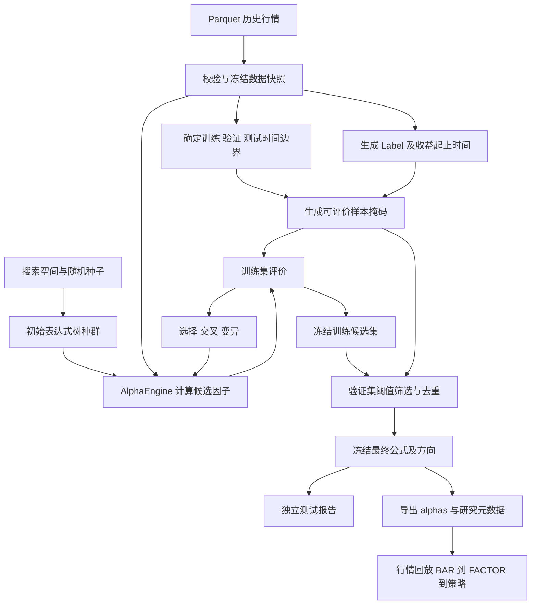

# Alpha 自动搜索与行情回放设计

状态：设计稿，新增模块及命令尚未实现。

全局目录、核心接口与模块依赖见 [项目代码框架设计](code_framework_design.md)。通用研究数据准备最终放在 `alpha/research/`，下文 `mining/data.py` 为早期职责划分，由该公共模块承接。

## 1. 目标与范围

在现有项目上构建“历史行情 → 自动生成表达式 → 训练集评价与进化 → 验证集筛选 → 保存 Alpha → 行情回放”的工作流。

本阶段交付设计。首版实现以日线因子搜索、评价、结果导出及回放一致性为目标；模型训练、组合优化、成交撮合和实盘执行作为后续独立工作。Rank IC 衡量预测关系，不能替代扣除交易成本后的收益评价。

核心分工：

- 搜索模块回答“哪些表达式值得保留”。
- AlphaEngine 回答“给定行情和表达式，因子值是多少”。
- 回放模块按历史时间送入行情，使用固定表达式计算并交给策略。

搜索可以读取完整历史样本，但每个时点的因子只能依赖该时点及以前的数据。未来收益标签只提供给评价模块。

## 2. 当前代码与复用边界

| 现有位置 | 已有能力 | 设计中的用法 |
| --- | --- | --- |
| `vnpy/datafeed/parquet_datafeed.py` | 按条件读取历史 Bar | 统一行情入口 |
| `vnpy/datafeed/daily_store.py` | 按日持久化行情 | 可选的研究快照存储 |
| `vnpy/alpha/alpha.py` | Alpha 名称、公式及解析 | 保存和加载最终公式 |
| `vnpy/alpha/expression/` | 树节点、算子注册、解析、分析和编译执行 | 搜索空间约束与计算语义 |
| `vnpy/alpha/engine.py` | 批量计算、历史长度推断、最新样本 | 候选表达式与回放共用的计算引擎 |
| `vnpy/alpha/modeling/alpha_analysis.py` | 未来收益标签、每日 IC/Rank IC 及汇总 | 复用收益计算和评价；补充标签起止时间 |
| `vnpy/alpha/modeling/dataset.py` | 按完整日期切分及边界间隔 | 参考其接口，增加基于真实标签结束时间的边界检查 |
| `vnpy/alpha/modeling/factor_selection.py` | 因子阈值筛选 | 复用指标，扩展验证集筛选与相关性去重 |
| `vnpy/factor/realtime_service.py` | Bar 缓存、就绪判断及 Alpha 调用 | 最终公式回放 |
| `vnpy/main.py` | 导入或行情事件回放 | 保持为行情入口 |

当前缺少搜索空间配置、随机树生成、种群管理、交叉变异、进化调度及搜索结果记录。配置中也没有已选 Alpha。

当前横截面回放要求明确的股票池，且池内各股最新 Bar 必须对齐。含缺失行情时不能直接假定它与离线横截面计算一致。

## 3. 整体数据流



进化循环只读取训练集得分。验证集用于一次候选选择，不将验证得分反馈给交叉变异。最终集合冻结后生成测试报告；若据此改动搜索方案，原测试段就不能继续作为独立测试证据。

## 4. 数据与时间契约

### 4.1 行情输入

主键为 `(datetime, vt_symbol)`；首版必需字段为 `open/high/low/close/volume`。统一时区、频率和股票代码，检查重复主键、非有限价格和 OHLC 关系。冲突重复行默认报错，不静默选择一条。

清洗策略必须记录：无成交数据如何保留、非法行情如何排除、价格复权口径、可用股票范围。缺失 Bar 不默认填成虚构成交数据。快照记录实际起止时间，不把配置中的未来结束日期当作已有数据。

首版采用固定、显式股票范围；记录其来源和适用时期，不宣称已解决历史成分及退市样本完整性。价格复权口径不明时在数据报告中标为未确认。

### 4.2 Label

配置 `entry_offset` 与 `horizon`，均以每只股票的实际 Bar 序列为单位：

`label(t) = close(t + entry_offset + horizon) / close(t + entry_offset) - 1`

研究示例：`entry_offset=1, horizon=5`，对应下一根 Bar 收盘到其后第 5 根 Bar 收盘。它是评价口径，不意味着策略一定可以按该价格成交。

标签表单独保存 `datetime, vt_symbol, entry_datetime, exit_datetime, label`。缺少入场/结束价格的行不可评价；禁止将 Label 和这些未来时间字段传入表达式引擎。

### 4.3 时间切分与预热

- 按交易日期划分完整截面，不随机拆分行。配置使用显式 train/valid/test 日期范围，启动时检查互斥和顺序。
- 一条样本只有因子日期和标签结束时间都位于其所属分段内才参与评价。边界检查使用该股票真实 `exit_datetime`，避免停牌导致固定日期间隔失效。
- 验证和测试因子允许使用此前的历史行情预热；此前的标签和分段外得分不得进入当前评价。
- 首版按搜索空间允许的最大回看长度确定共同预热边界，减少不同窗口候选因评价区间不同而产生的偏差。
- 所有样本使用同一基础评价掩码；候选额外空值计入覆盖率，不能以删掉困难样本提高得分。
- 数据不足、有效截面股票数不足或有效日期不足时明确失败，不自动缩短分段。

## 5. 搜索空间与表达式生成

新增 `SearchSpace` 配置，定义允许字段、算子、常数、窗口、最大树深度、节点数、回看长度。算子签名和参数类型取自现有 OperatorRegistry，不另建一套计算语义。

首版先搜索时序表达式：加减乘除、Ref、Mean、Std、Delta 等现有引擎支持的算子。跨股票的 Rank 等算子待横截面缺失行情规则和回放一致性验收后加入；时序因子仍可用每日跨股票 Rank IC 评价。

初始生成过程：

1. 根据深度预算选择字段/常数叶子或算子。
2. 按算子参数类型递归生成子节点；窗口参数只能从合法正整数窗口集合中取值。
3. 使用现有分析器检查字段、参数、历史长度及横截面需求。
4. 对规范化树序列化并生成稳定哈希，去除结构重复候选。
5. 在有界尝试次数内补足种群；搜索空间不足时明确报错。

例如生成 `volume / Mean(volume, 20)` 后，保存其树、可读公式及哈希。哈希用于结构去重，不声称能识别所有数学等价表达式。

第一版采用串行搜索、自有树操作和固定随机种子，优先保持与已有表达式树一致；暂不引入新的 GP 框架。

## 6. 评价与进化

### 6.1 单个候选的评价

输入：候选表达式、行情特征表、训练样本掩码、独立标签表。

输出：候选状态、有效覆盖率、有效日期数、每日 Rank IC、均值、IR、复杂度及最终适应度。

首先做硬过滤：编译失败、超过资源限制、常数因子、覆盖率不足、有效日期不足均不参与选择。除零等非有限结果沿用引擎的空值语义，记录原因和数量。

首版适应度建议采用 `abs(mean_train_rank_ic) - complexity_penalty * node_count`，具体惩罚系数和阈值属于研究配置，需要记录，不作为收益承诺。IR、覆盖率和子区间表现作为报告及筛选依据。NaN 指标不能进入排序。

方向只由训练集确定：`direction = sign(mean_train_rank_ic)`。验证时评价固定方向的因子，不能在验证/测试集重新取绝对值并翻转方向。

### 6.2 一代进化

保留精英候选，其余候选由锦标赛选择父代，再按配置执行交叉、变异或复制。

- 交叉：交换参数类型兼容的子树。
- 变异：替换字段、窗口或子树；新算子必须满足参数签名。
- 修改后重新检查深度、节点数、历史长度和哈希。
- 重试次数有上限；生成失败记录原因，不无限循环。
- 候选按稳定哈希打破同分，保证同数据、同配置、同版本、同随机种子的顺序可复现。

终止条件包括最大代数、最大候选评价次数或连续若干代无提升；首版用确定性的次数预算保证复现。缓存键包含表达式哈希、数据指纹、分段、评价配置与算子版本。

## 7. 验证筛选与产物

从训练集候选档案按训练分数取有限数量，统一进入验证集。通过预先配置的固定方向 Rank IC、覆盖率和有效日期阈值后，再按验证期因子相关性去重。相关性按同日期、共同股票样本计算并跨日期汇总，规定最小重叠样本量；无法评价重叠时单独报告。

输出目录设计：

```text
data/alpha_mining/<run_id>/
  config.json              # 完整有效配置与随机种子
  manifest.json            # 数据指纹、价格口径、时间范围、软件版本
  generations.jsonl        # 每代进度、数量、最佳训练分数
  candidates.parquet       # 公式、哈希、状态、淘汰原因和训练指标
  selected_alphas.json     # 原始公式、训练方向、训练/验证指标
  replay_alphas.json       # {"alphas": [{"name": ..., "formula": ...}]}
  test_report.json         # 冻结集合的独立测试指标
```

`replay_alphas.json` 只包含现有 Alpha 接受的 name/formula；direction 和指标留在研究产物中。负方向通过 `-(原公式)` 导出，保证回放和验证的方向一致。导出公式必须重新经过解析和编译校验。

没有候选通过筛选时输出明确的空结果与原因，不补入未达标因子。首版每次新建运行目录并记录完成/失败状态，文件原子写入；断点恢复属于后续功能。

## 8. 建议代码组织与接口

以下均为拟新增文件：

```text
vnpy/alpha/mining/
  __init__.py
  __main__.py      # 独立研究命令入口
  config.py        # MiningConfig、SearchSpace 及校验
  schema.py        # Candidate、FitnessResult、MiningResult
  data.py          # 数据快照、标签时间、切分及评价掩码
  generator.py     # 随机合法表达式树
  genetic.py       # 选择、交叉、变异
  evaluator.py     # 调用 AlphaEngine 与 AlphaAnalyzer
  selector.py      # 验证筛选及去重
  recorder.py      # 运行日志、缓存与产物
  workflow.py      # MiningWorkflow 总调度
```

主要接口设计：

```python
dataset = prepare_dataset(config.data, config.split, config.label)
population = generator.generate(config.search.population_size)
fitness = evaluator.evaluate(candidate, dataset, segment="train")
result = MiningWorkflow(config).run()
export_replay_alphas(result.selected, output_path)
```

拟提供命令 `python -m vnpy.alpha.mining config/mining.json`，该命令目前不可执行。搜索配置独立于 `runtime.json`；行情回放继续使用现有入口。第一版将导出的 `alphas` 显式合入回放配置，后续再考虑文件引用支持。

## 9. 回放接入及性能边界

搜索阶段按候选小批次复用内存中的行情和标签，及时释放因子矩阵，不长期保存“全部候选 × 全部日期 × 全部股票”。初版限制日期、股票数量和候选预算；更大数据的分区计算留待性能测量后实施，必须保留历史预热和完整截面。

回放仍是 `BAR → RealtimeAlphaService → AlphaEngine → FACTOR → StrategyEngine`。导入分支不参与这条执行链。配置表达式后，策略还需要独立启用并声明所需因子；搜索模块不自动选择交易策略。

接入前比较相同数据、公式、预热长度的离线结果与逐根回放结果。当前服务会从缓存收集股票并产生最新样本，应检查同一 `(datetime, symbol)` 重复发布问题；未来加入横截面算子前，需要基于完整时间批次明确截面何时结束、缺失成员如何处理以及每个样本发布次数。

固定股票池中成员当日无行情时，不能用未来值补齐，也不能默默等待而声称截面已完成。首版时序搜索先完成一致性验证；横截面支持作为独立里程碑。

## 10. 分阶段实现与验收

| 阶段 | 交付 | 验收重点 |
| --- | --- | --- |
| P1 数据与评价闭环 | 冻结小样本、真实标签起止时间、固定的少量示例公式、切分与评价报告 | 手算标签一致；跨界样本剔除；修改未来行情不影响过去因子 |
| P2 合法表达式生成 | SearchSpace、生成器、哈希及单批候选评价 | 固定种子可复现；签名合法；深度/回看限制有效；重复和失败处理有界 |
| P3 进化搜索 | 精英、选择、交叉、变异、候选档案、缓存与日志 | 下一代满足约束；训练之外的数据不进入适应度；次数预算可停止 |
| P4 筛选与导出 | 验证阈值、固定方向、相关去重、冻结集合及测试报告 | 空结果明确；验证/测试不能翻转方向；导出公式可重新加载 |
| P5 回放闭环 | 导出 Alpha 接入现有回放、结果核对 | 批量与回放同键数值一致；预热一致；无未来数据；检查重复 FACTOR |
| P6 横截面与规模扩展 | 同时点完整截面、缺失成员策略、分区及并行计算 | 缺失行情下离线/回放一致；并行不改变结果；内存预算可控 |

先完成 P1：用少量固定公式验证“行情 → 因子 → 标签 → 评价”数据契约，再引入自动生成和进化。这里的固定公式仅用于验证基础计算链路，最终公式来源仍是自动搜索。
