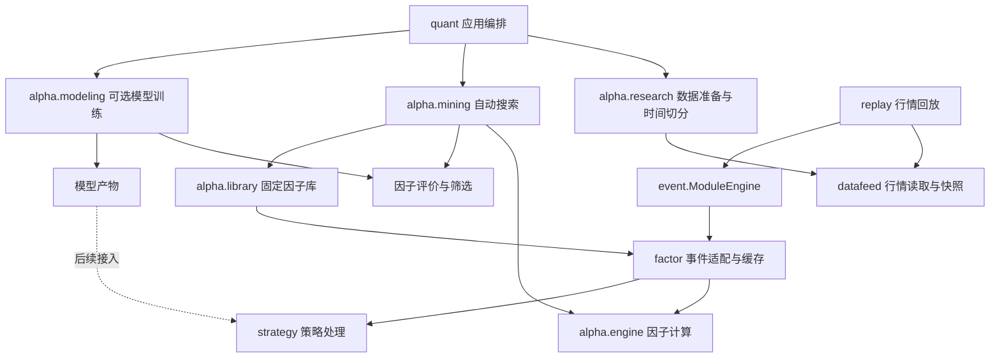

# 项目代码框架设计

状态：目标架构设计。标注“新增”的目录、类型和接口均未实现，不是当前可执行代码。

本文确定整个量化工作流的代码边界；[Alpha 搜索设计](alpha_mining_design.md)补充搜索算法与评价细节。目录职责以本文为准：通用研究数据准备从原提案的 `mining/data.py` 提升到 `alpha/research/`，供搜索与后续训练共同使用。

## 1. 架构总览

系统分为数据、表达式计算、研究、应用编排、事件运行、策略六部分。



箭头表示使用或数据交接。代码依赖规则：

1. `datafeed` 只负责行情，不引用搜索、训练和策略。
2. `alpha/expression` 只负责表达式语义，不读取配置文件或运行事件线程。
3. `alpha/engine.py` 计算已给定公式，不决定如何搜索或交易。
4. `alpha/research` 准备评价数据，不产生交易事件。
5. `alpha/mining` 搜索公式；`alpha/modeling` 训练预测模型，两者通过数据和产物衔接，不相互调用工作流。
6. `quant` 负责组合研究任务，不实现具体算子或遗传操作。
7. `replay` 装配事件模块；`factor` 负责 BAR 到 FACTOR 的适配；策略通过现有 StrategyEngine 接收事件。

首版搜索为普通 Python 调用，回放沿用已有事件队列。研究任务不需要包装成一个事件模块。

## 2. 目标目录

标记：`[已有]` 保留现有代码，`[扩展]` 后续增量调整，`[新增]` 本设计提出。

```text
vnpy-master/
├── config/
│   ├── runtime.json                 [已有] 回放/导入入口配置
│   ├── mining.json                  [新增] 数据、分段、搜索和筛选参数
│   └── training.json                [新增] 可选模型实验配置示例
├── docs/
│   ├── code_framework_design.md     [本文件] 全局代码框架
│   └── alpha_mining_design.md       [已有] 搜索算法设计
├── examples/
│   ├── alpha_formula_pipeline.py    [已有] 手写公式与计算示例
│   └── alpha_mining_pipeline.py     [新增] 小规模搜索示例
├── vnpy/
│   ├── main.py                      [扩展] 保留兼容启动入口，逐步简化
│   ├── common/
│   │   └── logger.py                [已有] 日志基础设施
│   ├── config/
│   │   └── runtime_config.py        [扩展] 回放配置校验及因子库引用
│   ├── datafeed/
│   │   ├── model.py                 [已有] BarData
│   │   ├── parquet_datafeed.py       [已有] 原始 Parquet 行情读取
│   │   ├── daily_store.py           [已有] 本地日线快照存储
│   │   └── bar_cache.py             [已有] 回放历史窗口缓存
│   ├── alpha/
│   │   ├── alpha.py                 [已有] Alpha(name, formula)
│   │   ├── engine.py                [已有] AlphaEngine、AlphaSample
│   │   ├── library.py               [新增] 因子库定义、校验、加载与导出
│   │   ├── expression/              [已有] 唯一表达式计算实现
│   │   │   ├── node.py              树节点
│   │   │   ├── operator.py          算子签名和注册表
│   │   │   ├── parser.py            公式解析
│   │   │   ├── analyzer.py          字段、窗口和截面需求分析
│   │   │   ├── polars_compiler.py   编译
│   │   │   └── executor.py          执行
│   │   ├── research/               [新增] 搜索和训练共用的数据契约
│   │   │   ├── schema.py            MarketSnapshot、ResearchDataset、SplitView
│   │   │   ├── config.py            DataConfig、LabelConfig、SplitConfig
│   │   │   ├── preparation.py       读取、清洗、数据指纹和预热
│   │   │   ├── labels.py            标签及实际收益起止时间
│   │   │   └── split.py             日期切分、边界剔除、评价掩码
│   │   ├── mining/                 [新增] 自动搜索表达式
│   │   │   ├── __main__.py          搜索命令适配
│   │   │   ├── config.py            SearchSpace、EvolutionConfig、SelectionConfig
│   │   │   ├── schema.py            Candidate、FitnessResult、MiningResult
│   │   │   ├── generator.py         生成合法树
│   │   │   ├── genetic.py           父代选择、交叉和变异
│   │   │   ├── evaluator.py         候选因子计算与训练适应度
│   │   │   ├── selector.py          验证筛选和去重
│   │   │   ├── recorder.py          搜索日志、候选档案及运行产物
│   │   │   └── workflow.py          MiningWorkflow 进化调度
│   │   ├── modeling/               [已有/扩展] 标签、评价、训练和推理
│   │   │   ├── alpha_analysis.py    复用 AlphaAnalyzer、兼容旧标签入口
│   │   │   ├── dataset.py           兼容旧输入，后续接受明确分段的数据
│   │   │   ├── preprocessing.py     预处理拟合与转换
│   │   │   ├── factor_selection.py  保留已有因子选择接口
│   │   │   ├── workflow.py          AlphaModelWorkflow
│   │   │   └── artifact.py          ModelArtifact
│   │   └── model/                  [已有] 模型接口与具体算法
│   ├── quant/                      [已有/扩展] 研究任务编排
│   │   ├── __main__.py              保留现有训练 CLI
│   │   ├── config.py                实验配置
│   │   ├── registry.py              已有模型和记录器注册
│   │   ├── workflow.py              保留 AlphaTrainingPipeline
│   │   ├── research_workflow.py     [新增，后续] 搜索结果到训练数据的衔接
│   │   ├── model.py                 ModelBundle、SignalFrame
│   │   └── experiment.py            LocalRecorder
│   ├── replay/                     [新增] 从 main.py 提取现有职责
│   │   ├── application.py           ReplayApplication 装配与生命周期
│   │   ├── runner.py                ReplayRunner 读取、限流与排空
│   │   └── modules.py               因子、策略模块注册
│   ├── event/                      [已有] ModuleEngine 和事件队列
│   ├── factor/                     [已有/扩展] 因子事件适配
│   │   ├── realtime_module.py       接收 BAR，发布 FACTOR
│   │   ├── realtime_service.py      缓存、就绪检查、调用 AlphaEngine
│   │   └── parquet_batch_runner.py  保留离线导入能力
│   └── strategy/                   [已有] 策略引擎、接口和具体策略
├── tests/
│   ├── research/                   [新增] 数据、标签和时间边界
│   ├── mining/                     [新增] 树操作和搜索闭环
│   └── integration/                [新增] 因子导出与回放一致性
└── data/
    ├── local_market/               行情快照
    └── alpha_mining/<run_id>/       每次研究配置、指标与因子库
```

目录树只列本次设计涉及的文件；其他现有模块保持原位。普通业务函数不强制抽象成基类。首版使用已有数据源和计算引擎，不新增通用插件框架。

## 3. 核心对象与接口

### 3.1 公共数据对象

| 对象 | 归属 | 关键内容 | 约束 |
| --- | --- | --- | --- |
| `BarData` | datafeed，已有 | 股票、时间、OHLCV、频率 | 行情输入 |
| `MarketSnapshot` | research，新增 | 特征行情表、数据指纹、数据口径 | 不包含 Label；相同主键唯一 |
| `ResearchDataset` | research，新增 | 快照、独立标签表、日期边界 | 负责产生分段视图，不将全表交给进化评分 |
| `SplitView` | research，新增 | 当前段可用历史、评分主键、对应标签 | 包含此前预热行情；不包含后续分段行情/标签 |
| `Alpha` | alpha，已有 | 名称、公式 | 对外公式定义 |
| `Candidate` | mining，新增 | 不可变树、稳定哈希、代数、父代来源 | 公式由树生成，避免树和公式双份编辑 |
| `FitnessResult` | mining，新增 | 状态、覆盖率、指标、训练方向、分数、失败原因 | 状态区分有效与淘汰；不以 NaN 排序 |
| `FactorLibrary` | alpha.library，新增 | 版本、已选公式、来源和必要数据口径 | 回放只取 Alpha 定义；研究指标不进入样本 |
| `AlphaSample` | alpha.engine，已有 | 股票、时间、收盘价、特征值 | 事件路径统一使用；不携带 Label |
| `ModelBundle` | quant.model，已有 | 模型、预处理、特征顺序、来源 | 后续与因子库标识绑定 |

`datetime/vt_symbol` 是表主键，`AlphaSample.datetime/symbol` 是事件对象字段；转换只发生在明确的适配边界。

### 3.2 数据准备

以下为拟定接口签名，省略导入与实现；并非可直接运行的代码。

```python
class ResearchDataBuilder:
    def build(self, data: DataConfig, label: LabelConfig,
              split: SplitConfig, warmup_bars: int) -> ResearchDataset: ...

class ResearchDataset:
    def train_view(self) -> SplitView: ...
    def valid_view(self) -> SplitView: ...
    def test_view(self) -> SplitView: ...
```

职责：读取和校验行情 → 构造独立标签表 → 按标签实际结束时间剔除跨段样本 → 给出分段视图。旧 AlphaDatasetBuilder 的收益公式可复用；逐步把通用计算实现归入 `research/labels.py`，旧入口保留适配，避免两套收益公式。

### 3.3 表达式搜索

```python
class ExpressionGenerator:
    def generate(self, count: int) -> list[Candidate]: ...

class GeneticOperators:
    def crossover(self, left: Candidate, right: Candidate) -> Candidate: ...
    def mutate(self, parent: Candidate) -> Candidate: ...

class CandidateEvaluator:
    def evaluate(self, candidate: Candidate, train: SplitView) -> FitnessResult: ...

class ValidationSelector:
    def select(self, candidates: list[Candidate],
               fitness: dict[str, FitnessResult], valid: SplitView) -> FactorLibrary: ...

class MiningWorkflow:
    def run(self, train: SplitView, valid: SplitView) -> MiningResult: ...
```

生成器和遗传操作共用算子注册表、搜索限制和显式随机数实例。Evaluator 复用 AlphaEngine 和 AlphaAnalyzer；构造引擎时只传公式，计算时只传行情表，算出因子后才与 Label 合并。

MiningWorkflow 管理种群、精英、评价次数、停止条件和候选档案。它只拿到训练与验证视图；测试视图不出现在接口中。独立测试由上层在因子库冻结后执行。

### 3.4 因子库

```python
class FactorLibrary:
    def to_alphas(self) -> tuple[Alpha, ...]: ...
    def save(self, path: Path) -> None: ...
    @classmethod
    def load(cls, path: Path) -> FactorLibrary: ...
    def export_runtime_fragment(self, path: Path) -> None: ...
```

原始公式和训练集确定的方向保留在研究记录中。供计算的公式已应用方向，例如 `-(volume / Mean(volume, 20))`。导出时解析、校验，禁止将未识别的额外字段直接传给 `Alpha(**item)`。

因子库包含格式版本、因子集合标识、数据频率、字段要求、最大历史长度、股票池/截面口径及来源运行标识。稳定集合标识由最终公式与计算语义生成，不依赖生成时间。

第一版只生成含 `alphas` 的配置片段。后续在 runtime 配置增加 `alpha_library` 文件路径；与内联 `alphas` 同时设置时明确报错，不隐式合并或覆盖。此字段当前不受支持。

### 3.5 回放

```python
class ReplayApplication:
    def run(self, config: RuntimeConfig) -> ReplayResult: ...

class ReplayRunner:
    def run(self, bars: Iterable[BarData], engine: ModuleEngine,
            config: ReplayConfig) -> ReplayResult: ...
```

ReplayApplication 加载公式、预先校验所需字段和股票池，创建并注册模块；ReplayRunner 按序投递 BAR、处理限流、等待队列排空；Application 在 finally 中停止模块。ReplayResult 记录输入数量、实际首尾时间、处理失败及完成状态。

从 main.py 提取行为时保持旧启动方式；ModuleEngine 逐步改为每次运行创建，便于隔离连续两次回放。应为队列失败/停止提供明确结果，避免下游失败后无界等待。不能仅凭“输入读完”认定回放成功。

BAR 默认只发给 factor，FACTOR 由 factor 发给 strategy。策略要直接接收 BAR 时需显式配置路由，不假定当前链路已有该行为。

## 4. 应用装配与三条执行路径

### 4.1 自动搜索入口

拟新增 `python -m vnpy.alpha.mining config/mining.json`。入口做参数解析与装配，算法留在业务类中。

```python
config = load_mining_config(path)
dataset = ResearchDataBuilder().build(
    config.data, config.label, config.split, config.search.max_lookback
)
result = MiningWorkflow(config).run(dataset.train_view(), dataset.valid_view())
result.library.save(output / "factor_library.json")
report = evaluate_frozen_library(result.library, dataset.test_view())
result.library.export_runtime_fragment(output / "replay_alphas.json")
```

代码展示职责顺序，实际实现还需 recorder 上下文、失败状态及资源清理。测试评价函数只生成报告，不改变库中的公式或方向。没有入选因子时输出空库和原因，跳过不适用的测试指标。

### 4.2 回放入口

现有 `vnpy/main.py` 保留，通过 RuntimeConfig 调用 ReplayApplication。它可消费手写 Alpha 或搜索导出的 Alpha；回放不在后台重新搜索公式。

```text
RuntimeConfig + 固定 Alpha
        ↓
ReplayApplication → 模块注册与启动
        ↓
ReplayRunner → BAR → RealtimeFactorModule
                         ↓
                   RealtimeAlphaService
                         ↓
                     AlphaEngine
                         ↓
                 FACTOR → StrategyEngine
```

### 4.3 可选模型训练入口

保留现有 `python -m vnpy.quant <配置> --observations <文件>`。后续由 `quant/research_workflow.py` 将固定因子库计算结果转换为 FactorObservation，或向 AlphaModelWorkflow 传入新的显式 DatasetSplit。

必须先扩展训练工作流以接受外部时间边界，避免重新按比例切分导致测试段进入训练。预处理只在训练段拟合；选定模型后若需用训练+验证重新拟合，要作为单独、已冻结选择结果的阶段，不能把该验证段继续报告为独立验证。当前实现的预处理使用训练+验证拼接拟合，需要在接入时调整。

后续模型产物绑定因子库标识、特征顺序和数据口径，推理前校验。现有 MlSignalStrategy 目前是规则信号示例，不把它当作已接通的模型推理入口。首版不自动扩展订单、账户或实盘模块。

## 5. 配置职责

| 配置部分 | 内容 | 使用者 |
| --- | --- | --- |
| `mining.data` | 数据源、日期、频率、股票、清洗和价格口径 | ResearchDataBuilder |
| `mining.label` | entry_offset、horizon | 标签构造器 |
| `mining.split` | train/valid/test 显式时间范围 | 分段构造器 |
| `mining.search_space` | 字段、算子、窗口、树和历史长度上限 | 生成器、遗传操作 |
| `mining.evolution` | 种群、代数、随机种子、精英和评价预算 | MiningWorkflow |
| `mining.evaluation` | 覆盖率、样本门槛、复杂度惩罚 | CandidateEvaluator |
| `mining.selection` | 验证阈值、相关阈值、最终数量 | ValidationSelector |
| `mining.output` | 输出根目录 | MiningRecorder |
| `runtime` | 行情回放条件、因子定义、模块参数 | ReplayApplication |
| `training` | 模型、预处理与实验参数 | AlphaTrainingPipeline |

所有配置路径相对所属配置文件解析；旧 runtime 路径语义先保持兼容，迁移时有明确适配。入口先完整校验参数再读取大量行情。给每次运行记录解析后的有效配置，避免依赖不可见的默认值。

## 6. 运行状态、资源和测试边界

- 数据错误、无可用评价日期、输出失败属于任务失败；某个公式非法或数值无效属于候选淘汰。禁止吞掉前者并返回成功。
- SearchResult/ReplayResult 与 recorder 区分 completed、failed、cancelled；首版取消后保留已有日志，不承诺断点恢复。
- 单个计算进程、有限候选批次和显式内存预算作为初始实现；不把大行情表复制进每个 Candidate。
- 缓存至少按数据指纹、公式哈希、分段、算子语义版本、评分配置隔离。首版只缓存评分及必要的有限因子结果。
- Formula AST 与公式往返、手算标签、实际时间边界、固定种子树生成、方向冻结、未来数据不影响过去结果、离线/回放一致性为核心测试。
- 横截面扩展前增加完整日期批次及缺失成员契约。核对同键 FACTOR 重复发布；最终库有多种历史窗口时，预热与样本缺失策略必须一致。
- 日志汇总每代有效/无效候选数量、最佳训练分数和停止原因；公式级错误保存到档案，避免控制台逐行淹没进度。

## 7. 落地顺序

1. 建立 `research` 数据对象、标签时间与分段接口，用现有 AlphaEngine 完成固定公式评价。
2. 建立 `mining` 的配置、Candidate、生成器与单批评价。
3. 加入遗传操作、进化调度、日志和预算控制。
4. 完成验证筛选与 `FactorLibrary` 导出，独立生成测试报告。
5. 提取 `replay` 装配代码，核对导入公式与事件回放的一致性。
6. 在数据契约稳定后接入可选模型训练，再扩展横截面搜索和性能。

不需要预先为以上目录创建只有 pass 的实现文件。按阶段完成可运行、可核对的纵向功能；已有 API 保留兼容入口，逐步迁移调用者。
